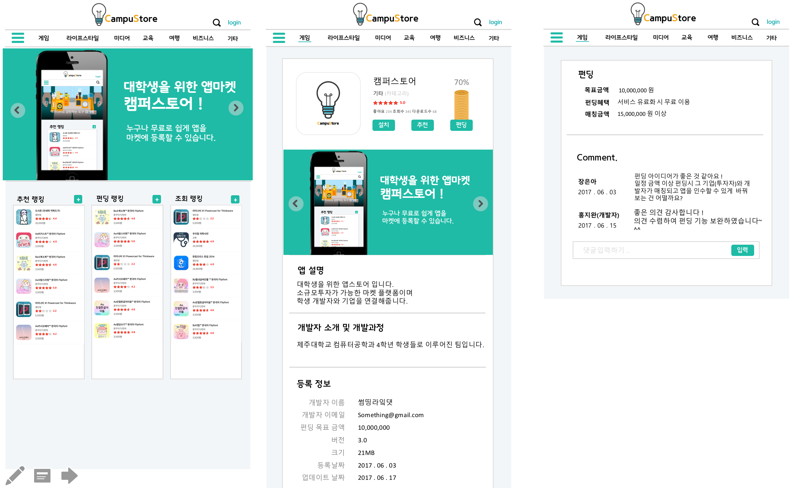

## CampuStore (캠퍼스토어)
#### 기업과의 매칭 및 소규모 투자가 가능한 마켓 플랫폼
- 소개 : 대학생 공모전이나 전시회에서 출품되는 앱이나 소프트웨어 중 많은 시간을 들여 개발하지만 버려지는 앱들이 대부분입니다.
 대학생들의 창의적인 아이디어가 사람들에게 알려지지 못하고 폐기되는 것이 아쉬워서 만들게 된 서비스입니다.  
 
- 주요기능
  - 소프트웨어 등록 : 학생 개발자들의 어플리케이션, 소프트웨어를 무료로 쉽게 마켓에 등록     
  - 추천 및 펀딩기능 : 소규모 투자를 통해 개발에 필요한 비용을 모을 수 있습니다. 
  - 학생개발자와 기업과의 매칭
      : 기업이 일정금액 이상 펀딩하게 되면 개발자와의 매칭이 가능합니다.
        설정금액 이상 투자한 투자자에게 소프트웨어의 인수 권한이 주어집니다
   
- 프로젝트 기간 : 2017.04 ~ 2017.09
- 팀구성 : 5인 ( 팀명. 썸띵라잌댓 )
- 역할 : 팀장 ( 기획, 디자인, 데이터베이스 )
- 기술 및 인프라 : AWS, mysql, Sping

